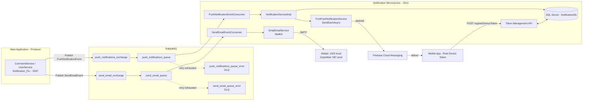
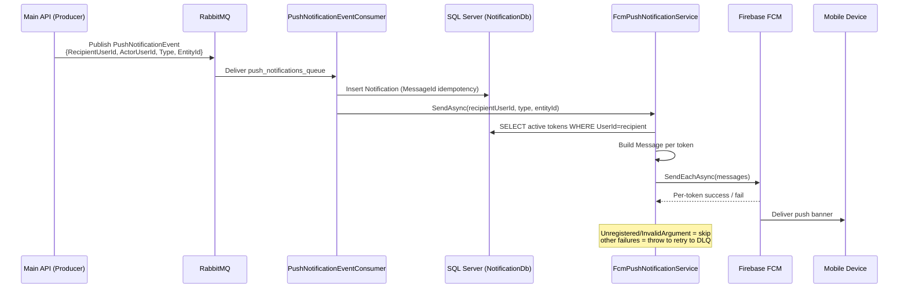
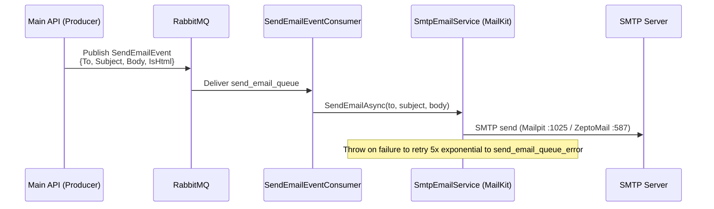

# Notification Microservice — .NET + RabbitMQ + FCM + SMTP

Event-driven microservice that decouples notification delivery from core APIs. Upstream services publish domain events to RabbitMQ, this service consumes them and delivers **Push (FCM)** and **Email (SMTP via MailKit)** reliably with retry + DLQ.

> Details + sketches: [`docs/ARCHITECTURE_FLOW.md`](docs/ARCHITECTURE_FLOW.md).

## Stack
- **.NET 10** Web API (`net10.0`)
- **MassTransit 8.3.6 + RabbitMQ** — pub/sub, retry + DLQ
- **FirebaseAdmin 3.6.0** — FCM push via `SendEachAsync`
- **MailKit 4.18.0 / MimeKit** — SMTP email
- **EF Core + SQL Server** — `Notifications`, `UserDeviceTokens`
- **Serilog + Swagger + JWT Bearer**

## High-Level Architecture



Same pattern for Push and Email — only exchange/queue/consumer/sender changes. SMS fits the same way later.

## Push Dispatch (detail)



## Email Dispatch (detail - same pattern)



## Design Sketches

Original whiteboard thinking kept in [`docs/ARCHITECTURE_FLOW.md`](docs/ARCHITECTURE_FLOW.md) + `docs/sketches/`. Mermaid above is source of truth, sketches show evolution.

| Sketch | File | What it shows |
|---|---|---|
| 1 - Main App to RabbitMQ to FCM | `docs/sketches/01-main-app-rabbitmq-fcm.jpg` | Best high-level overview |
| 2 - 1 Producer to 2 RabbitMQ to 3 Consumers | `docs/sketches/02-producer-broker-consumers.jpg` | Best concept slide |
| 3 - notification.fcm/.sms/.email routing | `docs/sketches/03-routing-queues-workers.jpg` | Routing idea (MassTransit uses fanout, see arch doc) |
| 4 - PushNotificationEvent detail flow | `docs/sketches/04-fcm-worker-detail.jpg` | Matches NotificationServiceImpl + FcmPushNotificationService |

> Save your 4 photos with exactly those filenames. Compress before commit.

## Event Contracts

Push (`Contracts/PushNotificationEvent.cs` - `[EntityName("push_notifications_exchange")]`):
```json
{ "RecipientUserId": "guid", "ActorUserId": "guid", "Type": "CommentLike", "EntityId": "guid" }
```

Email (`Contracts/SendEmailEvent.cs` - `[EntityName("send_email_exchange")]`):
```json
{ "To": "user@example.com", "Subject": "string", "Body": "string", "IsHtml": true }
```

## Reliability

- `Program.cs`: `UseMessageRetry(r => r.Exponential(5, 1s, 20s, 3s))` on both queues.
- Exhausted -> DLQ: `push_notifications_queue_error`, `send_email_queue_error`.
- No try/catch swallow in consumers/services - exceptions bubble to MassTransit.
- Idempotency: `Notifications.MessageId` + unique index `UX_Notifications_MessageId`.
- Dead FCM tokens (`Unregistered`/`InvalidArgument`/`SenderIdMismatch`) skipped, not retried.

## Token API (`Controllers/NotificationController.cs`)

- `POST /api/Notification/registerDeviceToken` (Auth)
- `GET /api/Notification/get/deviceTokens` (Auth)
- `DELETE /api/Notification/del/deviceToken?DeviceToken=xxx` (Auth)
- `POST /api/Notification/sendTestPush?recipientUserId=guid` (Auth)
- `POST /api/Notification/publishTestEvent?recipientUserId=guid&type=CommentLike`
- `POST /api/Notification/test-raw-token?deviceToken=xxx` (Anonymous, raw FCM test)

## Run Locally

```bash
docker start rabbitmq sqlserver
cd /home/sarthak/PersonalProjects/NotificationMicroservice
dotnet run  # :5011
```

RabbitMQ UI: `http://localhost:15672`.

## Local Producer -> Cloud Microservice (demo)

Producer and consumer never talk directly - both talk to same RabbitMQ:

```
Local Producer (laptop) -- AMQP 5672 --> Cloud RabbitMQ
Cloud Microservice (same RabbitMQ) --> FCM --> Your Phone
```

```csharp
cfg.Host(Environment.GetEnvironmentVariable("RABBITMQ_HOST") ?? "localhost", h => {
    h.Username("..."); h.Password("...");
});
```

## Mobile App (for real device token)

Emulator tokens do not work. Minimal Flutter app:

```dart
String? token = await FirebaseMessaging.instance.getToken();
// show on screen + POST /api/Notification/registerDeviceToken with JWT
```

Build `flutter build apk` -> install -> `test-raw-token` first, then full flow.

## Security Before Public Push

- Gitignore + remove: `firebase-key.json`, connection strings, SMTP pass.
- Use env vars / GitHub Actions secrets (`FIREBASE_KEY_JSON`, `RABBITMQ_HOST/USER/PASS`, `DB_CONNECTION`, `SMTP_*`).

## Docs

- [`docs/ARCHITECTURE_FLOW.md`](docs/ARCHITECTURE_FLOW.md) - sketches + Mermaid + code mapping
- [`BRD_NotificationMicroservice.md`](BRD_NotificationMicroservice.md) - requirements
- [`SESSION_SUMMARY_NOTIFICATION_MICROSERVICE.md`](SESSION_SUMMARY_NOTIFICATION_MICROSERVICE.md) - handover

