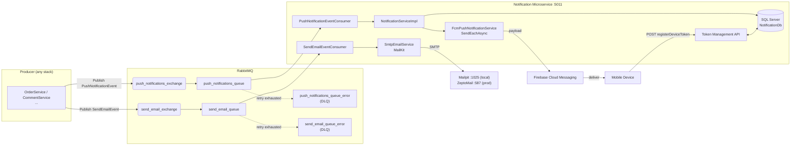
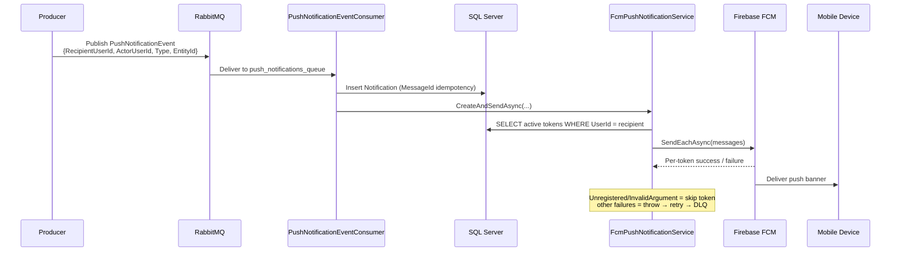

# Notification Microservice

Event-driven notification delivery service built with **ASP.NET Core 10**. Upstream services publish domain events to **RabbitMQ**; this service consumes them and delivers **push notifications (Firebase Cloud Messaging)** and **emails (SMTP)** with exponential retry, dead-letter queues, and idempotent persistence — so notification delivery never blocks or fails the business operation that triggered it.

## Contents

- [Why](#why)
- [Architecture](#architecture)
- [Tech Stack](#tech-stack)
- [Reliability Model](#reliability-model)
- [Authentication](#authentication)
- [API Reference](#api-reference)
- [Getting Started](#getting-started)
- [Docker](#docker)
- [Roadmap](#roadmap)

## Why

Tightly coupling notification delivery to a checkout, comment, or payment flow means SMTP timeouts and FCM outages become *your* service's outages. This service isolates that risk:

- **Producers stay fast** — publish an event, return a 200, done.
- **Delivery failures never lose data** — 5 exponential retries, then the message lands in a dead-letter queue for inspection/replay.
- **Duplicate deliveries don't duplicate rows** — a filtered unique index on `Notifications.MessageId` guarantees exactly one notification per event, even when the broker redelivers.

## Architecture



Push and email follow the identical pattern — only the exchange, queue, consumer, and sender change. SMS can be added as a third consumer without touching existing code.


### Message flow (push)



## Tech Stack

| Component | Choice |
|---|---|
| Runtime | .NET 10 (`net10.0`) |
| Messaging | MassTransit 8.3.6 + RabbitMQ |
| Push | FirebaseAdmin 3.6.0 (`SendEachAsync`) |
| Email | MailKit / MimeKit 4.18.0 |
| Persistence | EF Core 10 + SQL Server |
| Auth | JWT Bearer (resource server — validates, never issues) |
| Observability | Serilog (console), `GET /health` |
| API docs | Swagger / OpenAPI |
| Container | Multi-stage Dockerfile (SDK → aspnet, port 8080) |

## Reliability Model

| Concern | Implementation |
|---|---|
| Transient failures | Exponential retry ×5 (1s → 20s, factor 3) on both queues |
| Poison messages | Retry exhausted → `*_queue_error` DLQ, no silent swallowing |
| Idempotency | `Notifications.MessageId` + filtered unique index `UX_Notifications_MessageId` |
| Dead tokens | `Unregistered` / `InvalidArgument` / `SenderIdMismatch` FCM tokens are skipped, not retried |
| Error propagation | No try/catch swallowing in consumers — exceptions bubble to MassTransit |
| Config | RabbitMQ host/credentials, JWT, SMTP, DB all read from `appsettings.json` / environment |

## Authentication

This service is a **resource server**: it validates JWTs (signature, issuer, audience, lifetime) and deliberately has **no token-issuing endpoint**. Token issuance belongs to an identity service.

Locally, `scripts/generate-dev-token.py` plays the identity service — it reads the `Jwt` section from `appsettings.json`, so its signing key can never drift from what the service validates:

```bash
python3 scripts/generate-dev-token.py          # prints token + curl examples
TOKEN=$(python3 scripts/generate-dev-token.py --quiet)
curl -s -H "Authorization: Bearer $TOKEN" http://localhost:5011/api/auth/me
```


## API Reference

Base URL (local): `http://localhost:5011`

### Auth

| Method | Endpoint | Auth | Description |
|---|---|---|---|
| GET | `/api/Auth/me` | Bearer | Echoes validated claims; forged/expired tokens get 401 |
| GET | `/health` | — | Liveness probe |

### Device tokens

| Method | Endpoint | Auth | Description |
|---|---|---|---|
| POST | `/api/Notification/registerDeviceToken` | Bearer | Register an FCM device token for the current user |
| GET | `/api/Notification/get/deviceTokens` | Bearer | List the current user's device tokens |
| DELETE | `/api/Notification/del/deviceToken?DeviceToken=xxx` | Bearer | Remove a device token |

### Notifications

| Method | Endpoint | Auth | Description |
|---|---|---|---|
| POST | `/api/Notification/sendTestPush?recipientUserId=guid` | Bearer | Persist + dispatch a test push to the recipient's devices |
| POST | `/api/Notification/publishTestEvent?recipientUserId=guid&type=CommentLike` | — | Publish a `PushNotificationEvent` to RabbitMQ (full flow test) |
| POST | `/api/Notification/test-raw-token?deviceToken=xxx` | — | Raw FCM smoke test (bypasses DB) |

## Getting Started

### Prerequisites

- .NET 10 SDK
- Docker (for RabbitMQ + SQL Server)
- Python 3 (for the dev token script)
- `firebase-key.json` — Firebase service account, placed in the project root (gitignored; without it the service starts but push delivery logs a warning)

### Run

```bash
# Infrastructure
docker run -d --name rabbitmq -p 5672:5672 -p 15672:15672 rabbitmq:3-management
docker run -d --name sqlserver -p 1433:1433 \
  -e ACCEPT_EULA=Y -e SA_PASSWORD='YourStrong@Pass123' \
  mcr.microsoft.com/mssql/server:2022-latest

# Schema
sqlcmd -S localhost,1433 -U sa -P 'YourStrong@Pass123' -i setup_db.sql

# Service
dotnet run          # http://localhost:5011
```

Then open `http://localhost:5011/swagger`, mint a token, and hit `registerDeviceToken` → `sendTestPush`.

RabbitMQ management UI: `http://localhost:15672` (guest/guest).

### Try the full event-driven flow

```bash
TOKEN=$(python3 scripts/generate-dev-token.py --quiet)

# 1. Register a device (real FCM token from the Flutter app)
curl -X POST http://localhost:5011/api/Notification/registerDeviceToken \
  -H "Authorization: Bearer $TOKEN" -H "Content-Type: application/json" \
  -d '{"deviceToken":"<FCM_TOKEN>","devicePlatform":"android"}'

# 2. Publish an event through RabbitMQ — watch the consumer log, then the device
curl -X POST "http://localhost:5011/api/Notification/publishTestEvent?recipientUserId=<USER_GUID>&type=OrderPlaced"
```

## Docker

```bash
docker build -t notification-microservice .
docker run -p 8080:8080 \
  -e ConnectionStrings__db="Server=<host>;Database=NotificationDb;..." \
  -e RabbitMQ__Host="<host>" \
  -e RabbitMQ__Username="guest" \
  -e RabbitMQ__Password="guest" \
  notification-microservice
```

Secrets (DB password, SMTP credentials, `firebase-key.json`) are provided via environment variables or mounted files at deploy time — never baked into the image.

## Roadmap

- [ ] Consume `OrderPlaced` events from the Spring Boot e-commerce backend (cross-stack producer → consumer integration)
- [ ] CI/CD pipeline (GitHub Actions: build, test, container scan, deploy)
- [ ] Prometheus metrics + structured log correlation IDs
- [ ] SMS channel as a third consumer
- [ ] DLQ replay endpoint

In production the identity service signs with an asymmetric key (RS256/ES256) and this service validates via its JWKS endpoint — so a validating service can never mint tokens. The local HS256 shared-secret setup is the same shape, simplified.
